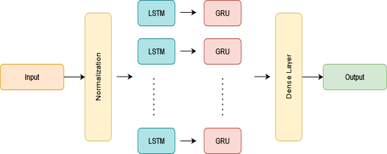
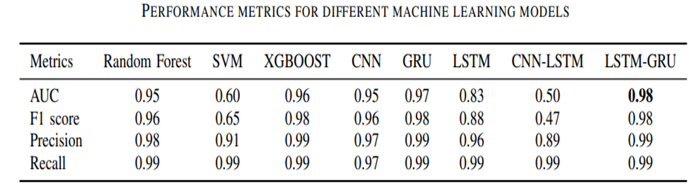
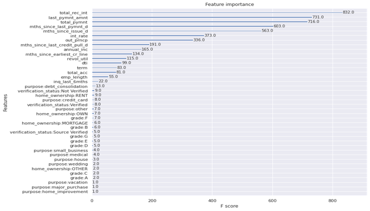

Fig1. Architecture of Hybrid Model (LSTM-GRU) 

# Credit Score Prediction Using Deep Learning Models

## Article Link
[Link to the Article](https://ieeexplore.ieee.org/abstract/document/10371827)

## Purpose
The purpose of this code is to predict credit scores based on historical loan data using deep learning models. The code implements several deep learning architectures including Convolutional Neural Networks (CNN), Gated Recurrent Units (GRU), Long Short-Term Memory (LSTM), and two hybrid models include (CNN-LSTM and LSTM-GRU). 

## Why Deep Learning?
Deep learning models are used in this project due to their ability to automatically learn hierarchical representations of data. They excel in handling complex patterns and relationships in large datasets, making them well-suited for credit score prediction tasks where the relationship between features and the target variable can be intricate and non-linear.

## Steps

1. **Importing Libraries**: Necessary libraries such as pandas, numpy, seaborn, matplotlib, and sklearn are imported.

2. **Loading Dataset**: The dataset named `loan_data_2007_2014.csv` is loaded using pandas.

3. **Data Preprocessing**:
   - Display an overview of the dataset's structure and information.
   - Plot the distribution of the target variable (`loan_status`).
   - Handle missing values by dropping features with over 80% missing values.
   - Categorize the loan status into a binary indicator (`good_bad`) based on whether the loan is fully paid or not.
   - Separate features and the target variable (`good_bad`).
   - Split the dataset into training and testing sets.

4. **Data Cleaning**:
   - Clean up and convert the `emp_length` feature.
   - Convert date columns to datetime format and compute the months since each date column.
   - Convert the `term` feature to numeric.
   - Perform feature selection using ANOVA F-Statistic for numerical features and Chi-squared test for categorical features.
   - Drop selected features from the dataset.
   - Convert categorical values to numerical.
   - Standardize the data.

5. **Model Implementation**:
   - Implement various deep learning models including CNN, Hybrid CNN-LSTM, GRU, Hybrid LSTM-GRU, LSTM.
   - Compile each model with appropriate loss functions and optimizers.
   - Train each model on the training data.
   - Predict using each model on the test data.

6. **Evaluation**:
   - Calculate and print evaluation metrics such as accuracy, ROC AUC score, F1 score, precision, recall, and confusion matrix for each model.

7. **Results**:
   Based on the provided confusion matrix for the LSTM-GRU model:

      True Positive (TP): 9685
      False Positive (FP): 509
      True Negative (TN): 82993
      False Negative (FN): 70

Following table presents the performance metrics of different ML models, including Random Forest, SVM, XGBoost, CNN, GRU, LSTM, CNN-LSTM, and LSTM-GRU, in predicting the target variable. We assessed the performance of each model by considering AUC, F1 score, precision, and recall. The results indicate that the LSTM-GRU model outperformed other models in all performance metrics, except for precision. Hybrid model (LSTM-GRU) achieves an AUC score of 0.98, F1 score of 0.98, recall score of 0.99, and precision score of 0.96. AUC is considered the most important metric in credit score prediction, as it offers an assessment of the model’s capacity to differentiate between good and bad credit applicants. The LSTM-GRU model achieves the highest AUC score of 0.98, indicating its superior performance in predicting credit scores compared to other models.

Fig 2 depicts the importance scores of our dataset. The results show that a few features have considerably high importance, whereas most other features are negligible in their contribution to the model.

Fig 2. Feature importance of the dataset

9. **Conclusion**:
   - The code concludes by providing evaluation results for each implemented model.
